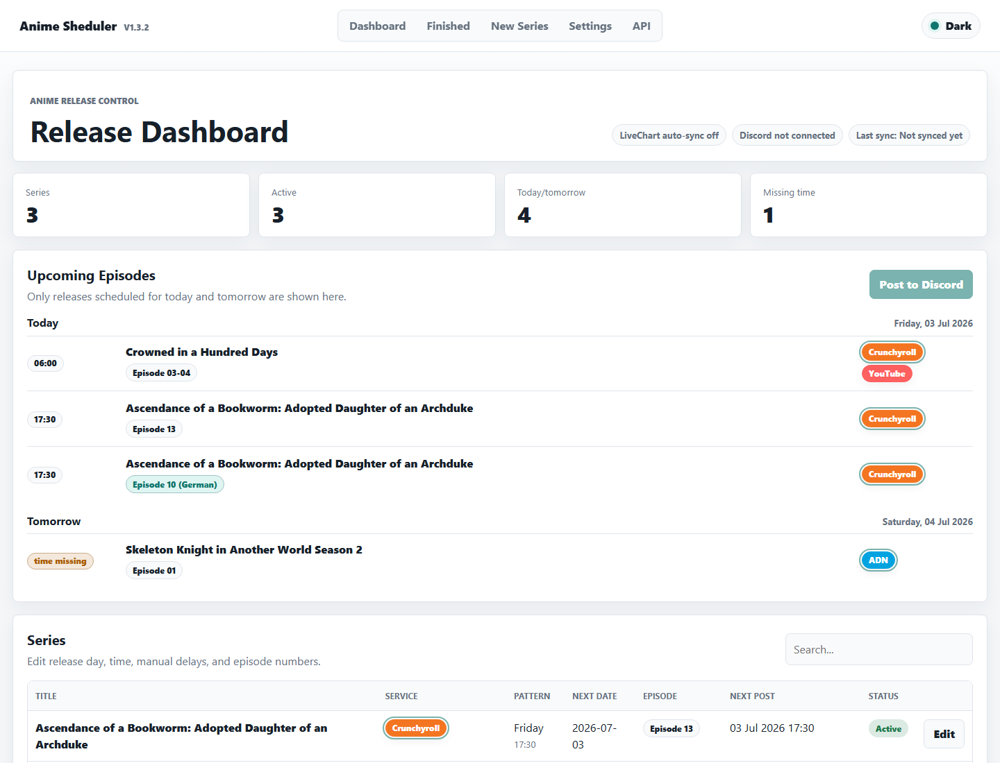
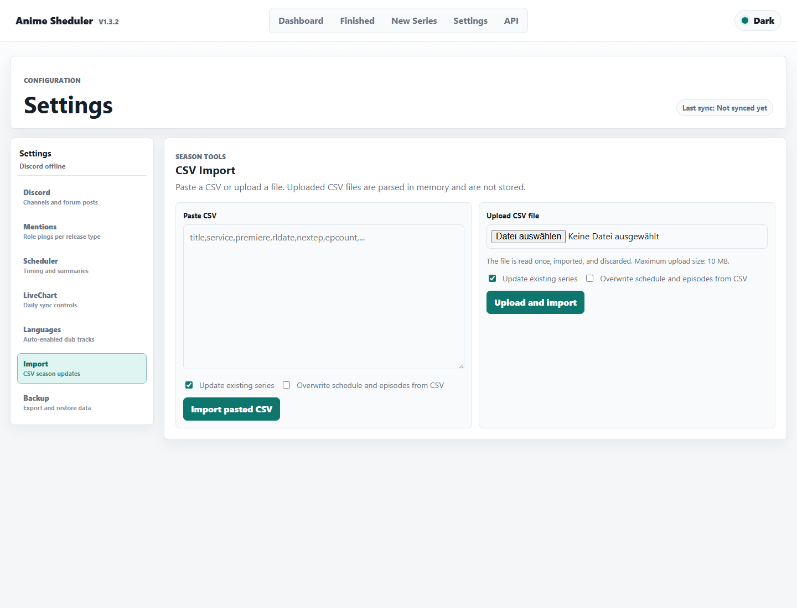
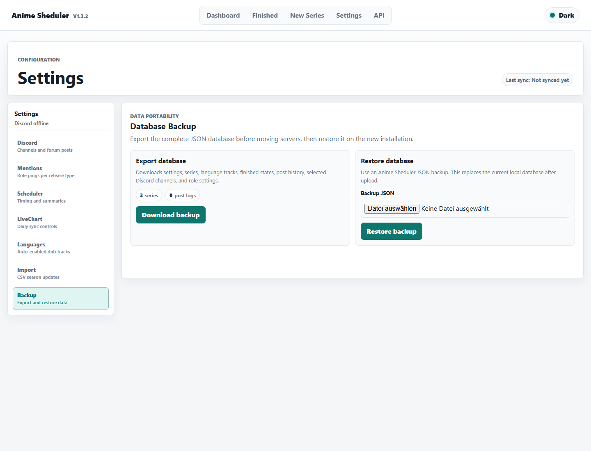

# Anime Sheduler

A self-hosted Discord bot with a web panel for weekly anime release schedules.

Anime Sheduler imports CSV season data, lets you edit release dates and language versions, syncs selected data from LiveChart, and posts due episodes to Discord.

Current version: `1.3.7`

## Highlights

- English web panel with light and dark theme
- CSV paste import, CSV file upload, and CLI import
- Editable release day, time, manual next date, next episode, total episodes, services, notes, LiveChart link, and poster image
- Separate tracking for language versions such as German dubs
- Daily LiveChart sync for active and finished series
- Automatic Discord announcements when episodes are due
- Multiple Discord servers, channels, forum posts, and role mentions
- Slash commands: `/upcoming` and `/shedule day`
- JSON database backup export and restore
- Docker Compose support for simple self-hosting

## Quick Start

Docker Compose is the recommended setup.

```bash
git clone https://github.com/Aiyomi-Irirako/anime-sheduler.git
cd anime-sheduler
cp .env.example .env
```

Edit `.env` and set at least:

```env
DISCORD_TOKEN=
DISCORD_CLIENT_ID=
WEB_PASSWORD=
```

Start the bot:

```bash
docker compose up -d --build
```

Open the web panel:

```text
http://localhost:3000
```

Check logs:

```bash
docker compose logs -f
```

## Screenshots



<details>
<summary>More screenshots</summary>





</details>

## Documentation

- [Setup Guide](docs/SETUP.md): Discord bot setup, configuration, Docker, reverse proxy, manual Node.js, and systemd
- [Windows Server Guide](docs/WINDOWS.md): PowerShell setup, Windows service/autostart, firewall, updates, and backups
- [Usage Guide](docs/USAGE.md): CSV import, editing releases, language versions, LiveChart sync, and Discord posting
- [Backup and Restore](docs/BACKUP.md): Web backups, raw `db.json` backups, and server moves
- [Troubleshooting](docs/TROUBLESHOOTING.md): Common problems, logs, health checks, and security notes

## Requirements

For Docker:

- Docker Engine
- Docker Compose
- Discord application and bot token

For manual installation:

- Node.js 20 or newer
- pnpm or npm
- A process manager such as systemd, PM2, Docker, or another host runtime

No privileged Discord gateway intents are required.

## Updating

```bash
git pull
docker compose up -d --build
```

Before major updates or server moves, download a backup in `Settings` -> `Backup`.

## Project Notes

There is no official hosted public instance included. This bot uses your own Discord bot token and is intended to run in your own environment.

The main database is JSON-based and portable. Docker stores it in the `anime-sheduler-data` volume by default.

## License

See [LICENSE](LICENSE).
